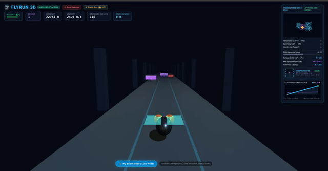

# FlyRun: Drosophila-inspired navigation experiments

FlyRun combines a browser runner with hand-written avoidance rules and a sparse,
reward-modulated associative controller. Separate Python experiments explore
Leaky Integrate-and-Fire (LIF) neurons, contrast-transient escape responses,
Hassenstein–Reichardt motion correlators, and three-factor STDP.

**This is a bio-inspired prototype, not a reconstruction of a measured fly
connectome.** Gameplay does not establish biological fidelity, learning benefits,
a sub-millisecond end-to-end deadline, or measured low-power operation.

<p align="center"></p>

<p align="center">
  <a href="https://gordonyfg.github.io/labs/"></a>
</p>

## What runs where

| Component | Implemented behavior | Limits |
|---|---|---|
| Browser autopilot | Exact game-state features → 24 inputs → up to 9 active features among 128 KC-like units → four action preferences, combined with avoidance rules | Continuous activations, not a spiking network; rules use obstacle identity and distance directly |
| Browser learning | Reward × action eligibility × KC-like activation; one-second eligibility decay in simulated time | Not spike-timing-dependent plasticity; improvement has not been demonstrated against a frozen-learning baseline |
| Browser eye and brain display | Illustrations and policy indicators | Not the controller's visual input or measured anatomical connectivity |
| Python circuits | Independent LIF, STDP and motion/contrast experiments | Hand-built connectivity; not connected to browser actuation |
| Python server | Static files and WebSocket incident logging | Connecting it does not enable a Python neural controller |
| Data exporter | NeuPrint extraction or explicitly requested synthetic examples, with provenance manifests | Exported graphs are not loaded by the current circuits; measured counts do not validate assumed effective weights |

## Run

From `projects/FlyRun`:

```bash
uv venv --python 3.12 .venv
source .venv/bin/activate
uv pip install -e .
python scripts/run_game_bridge.py
```

Open http://localhost:8080. Autopilot starts enabled; use the mode button for manual
play (arrows/WASD). The optional logger writes incident files under `data/`.
The HUD's controller compute time is measured locally and excludes rendering,
physics, input waiting and transport. Control runs once per animation frame.

For a fresh, seeded run use `http://localhost:8080/?seed=42&fresh=1`; add
`&learning=off` for a frozen-weight comparison. Seeded/fresh runs do not read or
write saved sessions. The seed controls obstacle generation, not rendering or
frame timing. Replaying the same initial seed is necessary but not sufficient
for identical trajectories across frame rates.

## Validate

```bash
pytest tests/ -v
node --test tests/test_browser.cjs
python scripts/run_mvp_looming.py
python benchmarks/benchmark_latency.py --steps 5000 --threads 1 --seed 0
```

The benchmark emits hardware/software settings, median/p95/p99/max and the
fraction of steps missing a 1 ms target. Add `--require-deadline` to fail on any
observed miss. Passing a finite benchmark does not guarantee future deadlines.
The MVP tests an expanding synthetic disk, not successful physical navigation.

The escape circuit removes additive whole-field brightness shifts before
integrating OFF contrast. It remains a contrast heuristic: selectivity against
translation, patterned lighting, and other non-looming stimuli is not established.
The Python KC model applies an explicit top-k spike cap alongside feedback;
this engineering constraint is not a validated biological APL model.

## Data provenance

```bash
export NEUPRINT_APPLICATION_CREDENTIALS="<YOUR_TOKEN>"
python data/export_subgraphs.py --dataset hemibrain:v1.2.1 --output-dir data/live
# Or explicitly generate unvalidated examples in a separate directory:
python data/export_subgraphs.py --force-synthetic --output-dir data/synthetic
```

Live extraction fails on missing credentials, query errors, empty graphs or
unknown neurotransmitter polarity. It never substitutes synthetic data. Dataset
coverage, neuron names and neurotransmitter fields must match the chosen server.
A manifest records source, dataset and file hashes; verify hashes when consuming
an export. Existing bundled Parquet files have unverified provenance and are not
biological ground truth. No FlyWire-specific importer is implemented.

## Performance and energy scope

CSR multiplication processes stored graph edges, not just synapses whose source
neuron fired. LIF integration also visits the population. A simulated 1 ms step
is not a 1 kHz wall-clock scheduler. Small-kernel CPU medians can be below 1 ms;
no portable latency guarantee or edge CPU/GPU comparison is established.

`EnergyEstimator` sums assumed energy per modeled synaptic event and neuron
update, then divides by simulated duration. Its output is a hypothetical
operation-energy model, not measured CPU/GPU power. It omits rendering, memory,
software overhead, idle power and other operations. The MVP counts LC4→GF events
only; it does not account for all retinal processing.

## Next validation work

Compare learning enabled and frozen on multiple held-out obstacle seeds, using
the same initial weights. Report collision rate, damage per distance, survival
distance and speed at several frame rates. Measure actual device energy before
making energy-efficiency claims. Validate circuit selectivity with translation,
recession, illumination and expansion controls, and document anatomical sources
before claiming connectome-derived wiring.

See [ARCHITECTURE.md](ARCHITECTURE.md) for model equations and implementation boundaries.
